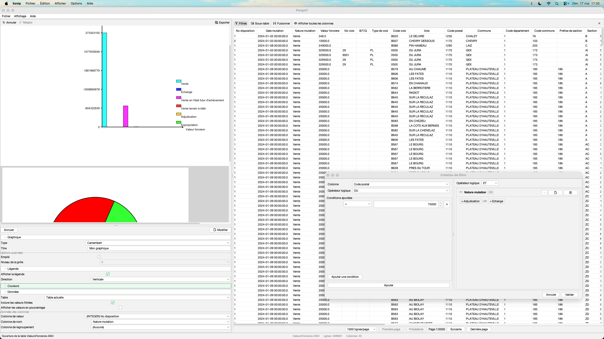

<h1 align="center">
  
  <br/>
  Pangol1
</h1>

<p align="center">
  <b>High-performance SVG reporting engine for massive tabular datasets</b>
</p>

<p align="center">
  Generate reports and SVG charts from CSV, TSV, Parquet and more built for very large datasets.
</p>

<p align="center">
  
  
  
  <a href="https://github.com/jules1univ/Pangol1/actions/workflows/build-jar.yml">
    
  </a>
  <a href="https://github.com/jules1univ/Pangol1/actions/workflows/test-junit.yml">
    
  </a>
</p>



## Features

- 📊 Generate **SVG charts** from tabular data
- 📄 Create complete analytical reports
- ⚡ Handle **massive datasets using Parquet**
- 🗂 Support multiple data sources:
  - CSV
  - TSV
  - TXT
  - XLSX
  - JSON
  - XML
  - Parquet
- 🖼 Export your charts to SVG
- 📑 Export your reports to HTML, PDF or Markdown

## Why Pangol1?

Most reporting tools struggle with very large datasets or generate heavy visual outputs.

Pangol1 is designed to:

- process large tabular files efficiently,
- generate lightweight SVG visualizations,
- produce portable reports suitable for analytics workflows.

**Massive data in, lightweight visuals out.**

## Requirements

Before running Pangol1, install:

- **Java JDK 21+**
- **Git**
- **VS Code** (recommended)

Check Java installation:

```bash
java --version
```

## Installation

Clone repository:

```bash
git clone https://github.com/jules1univ/Pangol1.git
cd Pangol1
```

## Build & Run

Compile manually:

```bash
javac -cp "lib/*" application/Pangol1.java
```

Run:

```bash
java -cp ".:lib/*" application.Pangol1
```

Or use generated JAR:

```bash
java -jar Pangol1.jar
```

## Dependencies

Pangol1 uses:

- **FlatLaf** modern UI theme
- **DuckDB JDBC** in-memory database for data processing
- **JUnit** testing
- **Batik** SVG to PNG conversion
- **OpenHTMLToPDF** HTML to PDF conversion
- **JavaFX** HTML rendering in WebView

## Documentation

- [Full Documentation](docs/DOCUMENTATION.md)
- [Contributing Guide](CONTRIBUTING.md)
- [Project Members](docs/MEMBERS.md)

## License

Distributed under the MIT License.

See [LICENSE](LICENSE) for more information.
